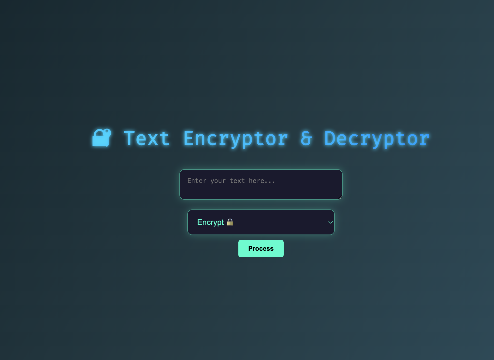

# 🔐 Text Encryption & Decryption Web App

A simple yet visually appealing web application that allows users to encrypt and decrypt text using Base64 encoding. Built with **Python (Flask)** on the backend and **HTML/CSS with animations** on the frontend.

---

## 🧠 Overview

This project provides a minimalistic yet functional interface for text encryption and decryption. It uses **Base64 encoding** as the encryption method and features a responsive and colorful design with animated elements.

Users can:
- 🔒 Encrypt sensitive text into an unreadable encoded format
- 🔓 Decrypt previously encoded text to its original form
- Enjoy a modern, clean, and interactive user interface

---

## 🚀 Features & Characteristics

- 🎨 Stylish frontend with CSS gradients, glow effects, and animations
- 🔁 Two-way operation: **Encrypt** and **Decrypt**
- ⚙️ Backend logic implemented with Python Flask
- 🔐 Uses Base64 encoding for simplicity and demonstration
- 💡 Real-time result display after user input
- 🌐 Lightweight and beginner-friendly codebase

---

## 📸 Screenshots

---

## 🛠️ Technologies Used

| Frontend         | Backend         |
|------------------|-----------------|
| HTML5            | Python 3.x      |
| CSS3 (Animations)| Flask Framework |
| Google Fonts     | Base64 Library  |

---

## 📂 Project Structure

![Project structure] (FileStructure.png)

